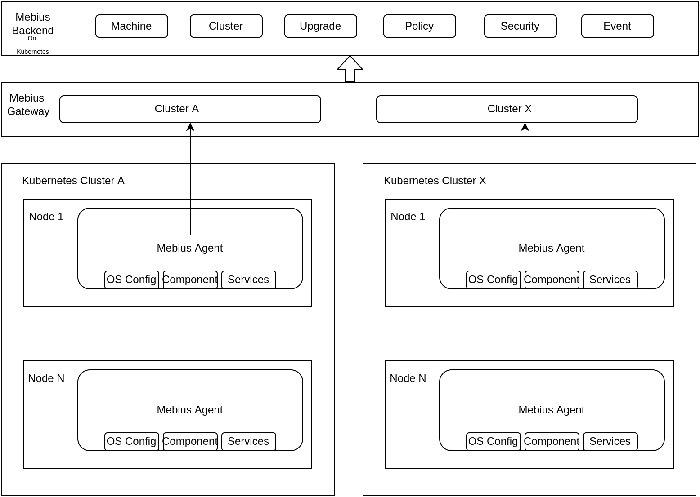

# Mebius
kubenetes operator最佳实践

## Why Mebius
Mebius 是一个用Kubernetes Operator的思想，去管理多个Kubernetes集群，其中包括机器(节点)管理、集群管理、集群变更、策略/安全配置和事件分发的统一管理方案

* Backend 主要是负责一些通用业务逻辑+agent方案管理，外加Controller
* Gateway 负责多个对接per cluster agent通信，也可以对接不同的Backend
* Agent 主要是负责获取远端配置+执行的Worker
